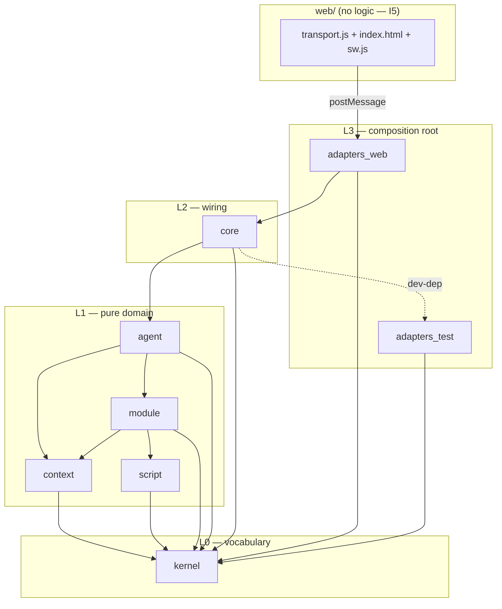

# ARCHITECTURE.md

> **Status: intended architecture, pending spike evidence.** Every claim a spike could overturn is
> marked `TBD(spike-…)`. Spike A = seam/transport, B = Rhai module round-trip, C = context assembly,
> spike-idb = IndexedDB from Rust. Provisional calls are marked `PROVISIONAL` with the alternative
> noted. Decisions are recorded in `DECISIONS/ADR-NNN` (owned elsewhere); this document references
> them and does not restate them. Vocabulary (Module, Section, Document, Phase, Event, Effect,
> Capability, Affordance, Forge) is the `GLOSSARY.md` term set — PROMPT §14 G1.

---

## 1. The attack on §11

Four boundaries in the straw-man are contentious. Per the operating contract, each gets two viable
designs, the strongest argument *against* the preferred one, then a recommendation.

### 1a. Thirteen crates for a solo project

**Design 1 — keep the 13-crate straw-man.** Every boundary is compiler-enforced; a layering
violation cannot compile, let alone pass CI.

**Design 2 — merge to 8 crates**, collapsing only boundaries that carry no enforcement weight:

- `http` + `ports` → `kernel`. The straw-man's own layering table puts `kernel`, `http`, `ports`
  in **one row with identical import rules**. Same row = same layer = the crate boundary between
  them enforces nothing. `Request`/`Response` and the port traits are leaf vocabulary exactly like
  ids and errors. Routing *dispatch* (path → module) needs the registry and was never really
  "pure http" — it moves to `core`.
- `phase` → `agent`. §9's phase machine *is* the agent's control flow: the phase selects the
  Document, `step()` walks the phases. Two crates for one state machine is ceremony; the boundary
  between them would be crossed by nearly every type either one defines.
- `forge` → a built-in module (see 1a-forge below).
- `view` → merged into `module` (see 1b).
- `script` **stays its own crate.** Not for layering — to quarantine the one heavy external
  dependency (Rhai, per ADR-003) so the pure domain's compile graph and dependency audit stay
  clean. A dependency-isolation boundary is a real boundary.

**Against my preferred option (Design 2):** merging crates deletes compile-time walls, and a solo
engineer has no reviewer to catch a casual `use` that welds `context` to the registry. In-crate
module boundaries (`mod`) are advisory; crate boundaries are not. Thirteen crates cost only
Cargo.toml boilerplate — cheap insurance.

**Counter and recommendation:** the walls worth having are *between layers*, and the straw-man's
own table defines only four layers — the intra-row crate splits were never enforced by it. Every
merge above stays within one row, so the CI-checkable property is byte-identical before and after.
Thirteen crates is legibility debt (13 manifests, 13 versions, cross-crate churn on every type
move) purchasing walls the table never demanded. **Recommendation: Design 2, 8 crates.**
`PROVISIONAL` — if a merged seam is repeatedly violated in review, promote it back to a crate;
reversal is `cargo new` plus moving files.

**Forge: crate vs module.** §7's own text: "the pipeline is itself a module." A dedicated `forge`
crate makes the forge structurally privileged — exactly what I9 (uniform modules) forbids the
*system* from doing, and a standing temptation to let it cheat. As a built-in module in `agent`
(it is agent behavior: Scout proposes, Forge builds) it exercises the same Module contract it
installs others through. **Against:** the forge is the flagship subsystem and will grow; burying
it risks `agent` blowing the I12 size limits. Accepted: promote to a crate the day it outgrows its
directory — same one-row reversal as above.

### 1b. `view` as a crate vs HTML-in-module templates

**Design 1 — central `view` crate** owning all fragment templates. One place to audit escaping,
one visual grammar, templates reviewable together.

**Design 2 — modules own their templates.** A module ships manifest + logic + view (§6). Forged
modules *must* carry their view as data — they cannot add to a compiled crate. If built-in
modules' HTML lives in a central crate while forged modules carry their own, built-ins and forged
modules render through different mechanisms, and I9 dies at the rendering seam — the exact place
§6 says the dashboard is composed.

**Against Design 2:** scattered templates invite inconsistent escaping and drifting markup; a
central crate is the natural audit point for XSS in an app that renders agent-authored HTML.

**Counter and recommendation:** centralize the *primitives*, not the templates: one small `view`
module inside the `module` crate — HTML escaping, the page shell, `hx-*` attribute builders,
the fragment type. Every template, built-in or forged, is composed from those primitives; the
audit surface is the primitives, which is smaller than a template crate. **Recommendation:
Design 2 with shared primitives.** Escaping-by-construction (fragments built only through the
escaping builder) is the enforcement, not code review.

### 1c. `step(state, event) -> (state, effects)` vs plain async fns with injected ports

**Design 1 — async fns.** `async fn run_turn(state, ports) -> Outcome`; ports injected as traits.
The honest case *for* it: this is the most legible possible shape — a turn reads top-to-bottom as
straight-line Rust, and legibility is the judging criterion. Injected fake ports give fast unit
tests; injected clock/rng gives determinism of *outputs*. No effect enum, no runtime loop, no
non-local control flow to chase.

**Design 2 — the pure step function** with an `Effect` enum executed by a small runtime loop.

§11 demands any alternative beat `step()` on six properties. Scored honestly:

| Property | async fns + ports | `step()` |
|---|---|---|
| Determinism | yes (inject clock/rng) | yes |
| Trivial unit tests | yes (fake ports) | yes (assert on returned effects, no fakes at all) |
| Replay / time-travel | partial — port calls loggable, but state *between* awaits is implicit in the future | yes — the event log replays through a pure fn |
| Snapshot / restore | **no** — a suspended future is not serializable | yes — `AgentState` is data |
| Pause/resume across refresh | **no** — refresh kills the Wasm instance mid-await; the turn is lost | yes — reload state + pending effects from the log |
| Wall between thinking and doing | advisory (a turn *can* await anything) | structural (`step` cannot do I/O; it can only describe it) |

Async fns lose outright on the two properties a browser host makes non-negotiable: the user *will*
refresh mid-turn (I11 makes refresh the update channel), and I8 already mandates the event log
that `step()` needs — the effect system is event sourcing's natural other half, not an extra
system. **Against Design 2 (the real cost):** effect systems smear one logical action across
`step` → runtime → `step`, and debugging becomes archaeology through a loop. Mitigation, adopted
as a rule: effects stay **coarse** (one `CallModel`, one `InvokeTool` — never micro-effects), so
one Work-phase turn is one step in, one effect out, one event back (§9's "one step per call"
already guarantees this granularity), and the runtime loop lives in `core` at under 40 lines.
**Recommendation: `step()`.** Streaming is the one open threat — token deltas as Events could
flood the log or force fine-grained effects. RESOLVED(spike-A → ADR-002): streaming is
core-driven htmx chaining — each chunk is an ordinary `Request → Response` cycle, deltas never
enter the event log, and only the completed message becomes an Event. Replay granularity holds.

### 1d. Where the Worker boundary sits

**Design 1 — core Wasm on the main thread.** `transport.js` calls the Wasm export directly. No
postMessage, no structured-clone, trivially debuggable, one less moving part.

**Design 2 — core in one long-lived dedicated Worker.** Main thread holds htmx + a ~50-line
transport that postMessages `Request`/`Response` (§5 option B); the Wasm instance and all port
adapters live in the Worker.

**Against Design 2:** the Worker adds postMessage serialization on every interaction and makes
DevTools debugging two-context. Model calls are async `fetch` either way — the main thread never
blocks on network, so the common case gains nothing.

**Counter and recommendation:** the jank risk is not network, it is **compute we don't control**:
forged Rhai modules (unbounded agent-authored loops) and large Document assembly run inside the
core. On the main thread a runaway forged module freezes the page *including the abort button* —
killing the observability and abortability the forge pipeline promises (§7). Script timeouts
mitigate but only the Worker makes the UI's liveness independent of the core's worst module.
Tier 2 (§10) already commits to Workers for multi-agent; one Worker from day one is the same
mental model, not a new one. **Recommendation: Design 2 — core in a Worker from the start.**
`PROVISIONAL`, and PARTIALLY RESOLVED(spike-A): the seam spike proved the transport with the
Wasm on the **main thread** (Design 1) — real htmx, 2/2 headless tests, zero app-route network
requests. The Worker variant remains unproven; G4 must drive the same transport through
postMessage, and if that is somehow prohibitive the fallback is the already-proven Design 1 —
the move is transport-only (the §3 seam is unchanged). The service worker remains caching
and updates only (ADR-002, ADR-007) — never a state holder.

---

## 2. Module map (recommended, 8 crates)

| Crate | Purpose (one line) | Must NOT absorb |
|---|---|---|
| `kernel` | Leaf vocabulary: ids, typed errors, Event + event log types, `Request`/`Response`, port traits (`ModelPort`, `StorePort`, `NetPort`, `ClockPort`, `RngPort`) | Any behavior; routing dispatch; HTML; anything importing another workspace crate |
| `context` | `Document`, `Section`, stability classes, budget/compaction, pure `assemble` + `render` (§8) | The module registry; model transport; any I/O. RESOLVED(spike-C): Part = Text/Image/Audio/File/Fragment carrying bytes not URLs (R2), proven under golden + prefix-identity tests |
| `script` | Embedded interpreter (Rhai per ADR-003) + capability binding table | Knowledge of agents, phases, or the registry; any ambient capability. RESOLVED(spike-B): binding = per-module Engine with capability closures, effective grants = manifest ∩ host-granted |
| `module` | Module trait + manifest + registry + generated Affordance document (§6, ADR-004); `view` submodule: escaping, page shell, `hx-*` builders, Fragment type | Business logic of any specific module; the interpreter itself (it *invokes* `script`) |
| `agent` | Pure `step()`, `AgentState`, the phase machine (§9, ADR-010), Scout + Forge roles; forge pipeline as a built-in module (§7) | I/O of any kind; port implementations; rendering beyond its own fragments |
| `core` | The seam: `handle(Request) -> Response` (§3); routing dispatch; effect-runtime loop (≤40 lines); wiring + built-in module registration | Domain logic; direct Web APIs; anything an adapter should own |
| `adapters_web` | wasm-bindgen port impls: fetch, IndexedDB (ADR-005; RESOLVED(spike-idb): hand-rolled web-sys, no wrapper crate — 52-crate tree + pin conflict), OPFS, WebCrypto, Worker glue; the composition root that owns the Wasm entry | Domain types beyond `kernel`'s; any logic that could run on the host |
| `adapters_test` | In-memory port impls for `cargo test` (dev-dependency of the pure crates) | Anything shipped to production |
| `ui` | The Dioxus app (increment 01): layout, theme, and the event handlers that call `core::handle` via `adapters_web::WebApp` | Any application logic; direct port construction; content it did not get back from the seam |

`web/` is the trunk source dir: `index.html` (the `ui` bin + relative asset links), `theme.css`,
`sw.js` (caching/updates only, ADR-007) which `importScripts("coi-sw.js")` for the cross-origin
isolation headers. `transport.js` and `vendor/htmx.min.js` are deleted — Dioxus supersedes ADR-002's
transport half.

---

## 3. Dependency graph

Intra-domain direction is `agent → module → {context, script}` and is **declared here, which the
straw-man's table never did** — its four rows left the seven domain crates free to import each
other arbitrarily; the split was partly ceremonial for exactly that reason. `module → context`
(a module can provide a Section, so it needs the Section type) is the assumed direction —
RESOLVED(spike-C): assembly ergonomics raised no pressure for the reverse direction;
`module → context` stands.

---

## 4. Layering table (CI-enforced)

| Layer | Crates | May import (workspace) | Must NOT import |
|---|---|---|---|
| L0 | `kernel` | — (std, serde only) | any workspace crate |
| L1 | `context`, `script` | `kernel` | each other; `module`; `agent`; `core`; `adapters_*` |
| L1 | `module` | `kernel`, `context`, `script` | `agent`, `core`, `adapters_*` |
| L1 | `agent` | `kernel`, `context`, `module` | `script` (only via `module`), `core`, `adapters_*` |
| L2 | `core` | all L0–L1 | `adapters_*` |
| L3 | `adapters_web` | `kernel`, `core` | `agent`, `module`, `context`, `script` directly |
| L3 | `adapters_test` | `kernel` | everything else (pure crates take it as a dev-dependency) |
| L3 | `ui` | `kernel`, `adapters_web` | `core`, `agent`, `module`, `context`, `script` directly |

**Straw-man bug, fixed here:** §11 forbade `adapters_*` from importing `core` *and* `core` from
importing adapters — leaving no crate able to wire the application without a fourteenth it never
listed. Resolution: `adapters_web` is the driving adapter *and* composition root (standard ports
& adapters), so `adapters_web → core` is legal; `core → adapters_*` stays forbidden and port
impls are injected as `dyn` trait objects at the entry point.

**Enforcement (check-script logic in prose; lives in CI, fails the build):**

1. Run `cargo metadata --format-version 1`; keep only workspace members.
2. Build the member-to-member dependency edge set (normal + build deps; dev-deps exempt only for
   `adapters_test` consumers).
3. Encode the table above as an allowlist map `crate → {allowed workspace deps}`; any edge not in
   the map fails with the offending `from → to` pair printed.
4. Assert `wasm-bindgen`, `web-sys`, `js-sys` appear in the transitive normal-dependency closure
   of `adapters_web` **only** — this is I3 as a mechanical check, not a convention.
5. Separately, CI runs `cargo test --workspace --exclude adapters_web` on a plain Linux host with
   no browser: if it compiles and passes, the pure-core property held this commit.

---

## 5. The property defended: host-testable everything (I3)

Every crate except `adapters_web` compiles and tests on the host — routing, rendering, assembly,
the phase machine, the forge pipeline, the registry, the script engine. Effect of each §1 change:

- **http/ports/phase/forge/view merges (1a, 1b):** no effect — every merge stays inside the pure
  set; the excluded-crate list is still exactly `adapters_web`.
- **Forge as a module (1a):** no effect — it tests on the host like any module, which is itself
  a live demonstration of I9.
- **`step()` retained (1c):** strengthens it — the whole orchestration cycle (§9's diagram) runs
  under `cargo test` with no model, no fakes even, by asserting on returned effects. The async
  alternative would have *kept* host-testability but surrendered replay and resume (I7's point).
- **Core in a Worker (1d):** no effect — the Worker is an `adapters_web`/`web/` runtime concern;
  no pure crate knows it exists.
- **Rhai in `script` (ADR-003):** Rhai is pure Rust, so forged-module logic itself is exercised
  by host tests — RESOLVED(spike-B): the capability-denied dry run runs under plain
  `cargo test` (6/6 green, typed denial errors, no browser).

---

## 6. Data flow walkthroughs

**An htmx click.** User clicks an element bearing `hx-get="/panels/water"`. The htmx extension
(`transport.js`) intercepts, posts `{method, path, headers, body}` to the core Worker.
`adapters_web` builds a `kernel::Request` and calls `core::handle`. Routing dispatch consults the
Module registry, finds the Module serving `/panels/water`, and invokes its logic with a `ctx`
carrying only its granted Capabilities (I6). The Module returns a Fragment (built via `view`
escaping primitives); `handle` wraps it in a `Response`, an Event is appended to the log (I8),
and the HTML string is postMessaged back. htmx swaps it into the `hx-target`. No JS logic ran (I5).

**An agent turn.** A user message arrives as an Event. `agent::step(state, event)` — pure — enters
Phase `Plan`: the Phase selects the Section set, and the returned `Effect::CallModel` carries
`context::assemble(state, Plan, budget)`, a Document with stable-first Section order and recorded
compaction (§8.5). The `core` runtime loop executes the Effect through `ModelPort`
(`adapters_web` → fetch → the configured endpoint; the Module never saw a key, I6). `render`
maps the Document to the provider's message format. The reply returns as the next Event;
`step` transitions `Plan → Work` (one tool step per call) `→ Verify` (no tools), each transition
an Event, every Effect (`Persist`, `Emit`) executed through ports. The dashboard re-renders as a
projection of the log — same mechanism as the click above.

**A forge install.** Scout proposes; the Forge (a built-in Module) runs the §7 pipeline, each
named stage emitting an Event: generate manifest + Rhai logic + view + tests (self-improvement
rung L2) → static validate → dry run in `script` with **all** Capabilities denied → declared
contract tests → preview Fragment rendered in a sandboxed iframe → Capability review (what it
asks for, why) → user approval arrives as an Event — a gate, never inferred. Then
`Effect::Persist` writes the module-as-data through `StorePort` (IndexedDB, ADR-005,
`TBD(spike-idb)`), the registry registers its routes, and the Affordance document — generated
from the registry, never hand-written — advertises it in the same instant (§6). The new panel is
on the dashboard with no rebuild; built-in and forged are now indistinguishable (I9). Rollback
is deletion of a record (I10); every prior version is kept.
