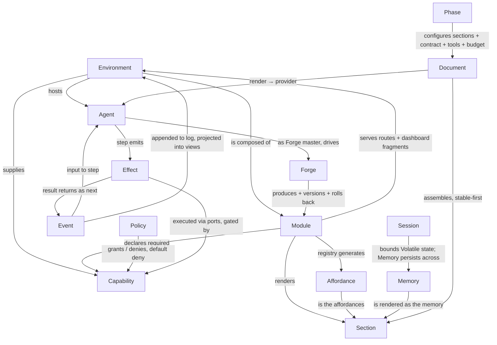

# DOMAIN

G1 artifact. How the fourteen glossary terms compose, plus the two normative definitions §14
assigns to G1: the starter section set and the stability classes. Vocabulary: `GLOSSARY.md`.

## 1. Domain model

Read it as one sentence per edge: the Environment hosts the Agent and is composed of Modules; the
Forge produces Modules; a Module declares Capabilities (Policy grants them), serves routes and
dashboard fragments, and renders Sections; the registry generates the Affordance account; the
Document assembles Sections stable-first; a Phase configures the Document; the Agent steps
Events into Effects, which execute through capability-gated ports and return as Events; a Session
bounds Volatile state while Memory persists across sessions. The dashboard and the paper are the
same composition mechanism aimed at two renderers (§8.4).

## 2. The section set (normative)

The eleven starter sections of §8.2, in canonical document order (most stable first, §8.3).
`id`, `intent`, `stability` are from the PROMPT; `priority` and `compaction` are G1 assignments,
`PROVISIONAL` as a set — refine against real budgets in G4, not by argument.

Priority: P0 never degrades; P1 degrades last; P2 next; P3 first. Compaction: the declared
degradation path, walked left to right as the budget bites (§8.5); a section never degrades past
the end of its path.

| # | id | Intent (one sentence, mandatory) | Stability | Priority | Compaction |
|---|---|---|---|---|---|
| 1 | `soul` | Who this agent is; values and voice. | Static | P0 | Full only |
| 2 | `identity` | Name, role, presentation. | Static | P0 | Full only |
| 3 | `operating_rules` | How to behave; the response discipline. | Static | P0 | Full only |
| 4 | `affordances` | What exists and how to use it (§6, generated). | Semi-static | P1 | Full → Summarized (names + one-liners) |
| 5 | `user` | Durable facts about the person. | Semi-static | P2 | Full → Summarized |
| 6 | `memory` | Retained knowledge across sessions. | Semi-static | P2 | Full → Summarized → Pointer |
| 7 | `environment` | Time, locale, device, what is available offline right now. | Dynamic | P2 | Full → Summarized → Elided |
| 8 | `task` | What is being attempted. | Dynamic | P1 | Full → Summarized |
| 9 | `history` | Conversation and prior steps. | Dynamic | P3 | Full → Summarized → Pointer → Elided |
| 10 | `observations` | Results of the last actions. | Volatile | P1 | Full → Summarized → Pointer |
| 11 | `response_contract` | The exact shape of the expected reply. | Static per phase | P0 | Full only |

Rules carried from §8.2–8.3, restated as law:

- **Intent is mandatory and is not decoration.** A section that cannot state in one sentence what
  it is for does not belong in the paper. This is the mechanism that stops prompts from accreting.
- **Nothing is empty by default.** An empty `soul` is a bug, not a blank.
- **This set is a starting point, not a fixture** — but any addition or removal goes through the
  forge with the same gates as any module change (§8.4), because sections are modules.
- `response_contract` sits **last** despite its Static-per-phase class: it is byte-identical given
  a phase, but it varies across phases within a task, so placing it in the tail keeps the shared
  static prefix (1–3) identical across Plan/Work/Verify and lets the provider cache hold for the
  whole task (§9).
- Phases subset this order, never reorder it: e.g. Plan drops `observations`; Work narrows
  `affordances` to the tools the step needs (§9).

## 3. Stability classes (normative)

Four classes. Every section declares exactly one. Order in the document is by class, strictly:
Static, then Semi-static, then Dynamic, then Volatile (with the `response_contract` tail exception
above, which is itself fixed and declared, not ad hoc).

| Class | Definition | Changes when |
|---|---|---|
| **Static** | Byte-identical across every call given the same agent configuration. | Only by a versioned forge change (a new configuration, not a new call). |
| **Semi-static** | Stable across many consecutive calls; changes only on discrete, attributable events. | Module install/uninstall, memory consolidation, a user-fact edit. |
| **Dynamic** | Expected to differ call to call as the task advances. | Every step: task state, history growth, clock/locale/availability. |
| **Volatile** | Valid only for the immediately next call; never carried forward. | Every call; produced by the last actions, consumed once. |

**Enforcement — tested, not assumed (§8.3, I14):**

1. **Byte-identity.** A section declaring `Static` must render byte-identically given the same
   inputs. Golden tests prove it; a violation is a bug in the section, not a tolerance.
2. **Never interleave classes.** A `Dynamic` section wedged between two `Static` ones invalidates
   everything after it. Document order is non-increasing stability, checked at assembly.
3. **Hunt accidental volatility:** unstable map iteration order, floating timestamps, "you have
   used N tokens" counters, locale-dependent formatting. Any of these placed early forfeits the
   entire cache win.

**Why (the cache rationale, §8.3):** provider-side prompt caching hits on an unchanged prefix.
Stable-first ordering keeps the prefix byte-identical across calls so only the tail is re-billed
and re-processed — lower cost and lower latency on every turn. One dynamic element placed early
forfeits it entirely. G0 measures how the target providers' caching actually behaves (minimum
cacheable prefix, TTL, invalidation); that measurement is the one thing allowed to move the
static/dynamic boundary (§18).

Interaction with multimodality (§8.6): large binary parts are usually both the most cache-relevant
and the most expensive to move; their placement in the document is a real decision, made per
section via `budget_hint` and this ordering rule.
