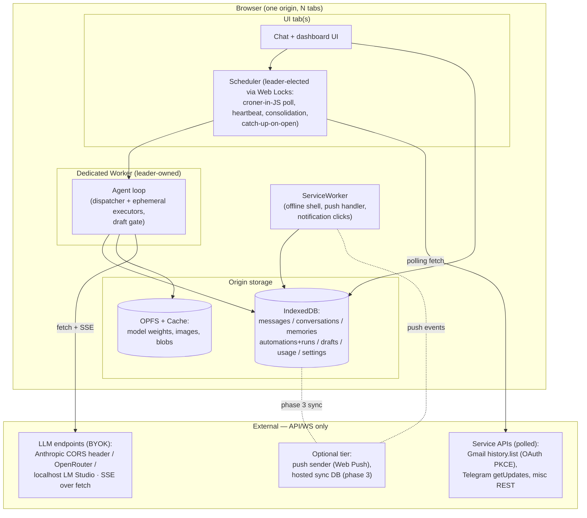

# 07 — Target architecture: boop-in-the-browser

Status: PROPOSED. This is the synthesis doc of the boop-agent review series
(see `00`–`06` for the deep dives on study, lifecycle, state, sync, LLM,
proactivity, and the agent loop). It stands alone: it states the target
browser-only architecture, what maps cleanly, what degrades, the decisions,
where it should live, and the build phases.

**The constraint (user's own words):** state, application, and logic all run
in the browser; the only external contact allowed is API calls or WebSocket
calls.

**What boop is today (verified in the clone):** a Node ≥20 always-on daemon
(Express + WS on :3456) whose truth lives in hosted Convex tables
(`messages`, `conversations`, `memoryRecords` with a 1024-dim vector index,
`executionAgents`, `usageRecords`, `agentLogs`, `automations`, `drafts`,
`settings`, `sendblueDedup`). iMessage arrives via a Sendblue webhook,
~1000 tool integrations go through Composio's hosted OAuth proxy, and the
LLM runtimes are subscription products spawned as child processes (Claude
Agent SDK → local CLI; codex app-server over stdio JSON-RPC). Proactivity is
in-process timers: `server/automations.ts` polls croner schedules every 30s,
`server/heartbeat.ts` fires every 60s, `server/consolidation.ts` runs a
daily adversarial memory pass, plus a Gmail webhook watcher. The dispatcher
(interaction agent, ~7 tools) spawns ephemeral scoped executors; every
outbound side effect passes a draft-before-send gate. The only
browser-native pieces today are the React debug dashboard and the Convex
browser client.

None of the *architecture* requires a server. The daemon exists for three
reasons only: an always-on clock, inbound webhooks, and child-process LLM
runtimes. Everything else — the loop, the memory model, the
dispatcher/executor split, the draft gate — is plain JS over fetch, and
moves.

---

## 1. Component diagram

Every arrow leaving the browser is a `fetch` or WebSocket. There is no
inbound network path — that single asymmetry drives every degradation in §3.

---

## 2. Subsystem mapping

| boop subsystem | Browser primitive | Fidelity |
|---|---|---|
| Agent loop (dispatcher/executor, tool calls) | Same JS in a dedicated Worker; tools are fetch calls | **Full** — pure JS + fetch, portable as-is |
| Claude Agent SDK / codex child processes | BYOK OpenAI-compat / Anthropic fetch + SSE; optional transformers.js WebGPU local tier | **Replaced** — subscription-plan runtimes need a spawned CLI; API keys replace them |
| Convex tables (truth) | IndexedDB object stores, same table names | **Full** at single-device; sync is phase-3 (§4.6) |
| memoryRecords 1024-dim vector index | Embeddings via BYOK endpoint or transformers.js; brute-force cosine over IndexedDB | **Full** at personal scale (thousands of records; no ANN index needed) |
| Memory pipeline (extract → decay → daily adversarial consolidation) | Same post-turn / scheduled JS, run by leader scheduler | **Full** (timing fidelity per next rows) |
| Automations 30s croner poll | croner (pure JS) in leader tab; catch-up-on-open for missed windows | **Degraded** — fires only while a tab lives; see §3 |
| Heartbeat 60s / consolidation 24h | Same leader timers + catch-up | **Degraded** — same lifetime bound |
| Inbound webhooks (Sendblue, Gmail watch, Composio) | Polling: Gmail `history.list` w/ PKCE OAuth; Telegram `getUpdates` (CORS-callable) | **Replaced** — no inbound path exists in a browser, ever |
| iMessage channel (Sendblue) | Web Notifications + optional Web Push; Telegram bot as the two-way remote channel | **Replaced** — iMessage is unreachable without an Apple-side daemon |
| Composio hosted OAuth proxy (~1000 toolkits) | Per-service OAuth PKCE + direct REST for the handful actually used | **Degraded** — breadth traded for zero hosted middleman |
| Draft-before-send gate (`drafts` table + approval) | Same table in IndexedDB, same approval UI in chat | **Full** — kept verbatim (§4.5) |
| usageRecords / agentLogs | IndexedDB stores + dashboard views | **Full** |
| Express + WS :3456 API surface | Not needed — UI and loop share the origin; in-memory channel / BroadcastChannel | **Dropped** — the server API existed to bridge two processes that are now one |
| React debug dashboard | Same, now the primary UI | **Full** — already browser-native in boop |
| Native Apple readers (Contacts/Notes/Calendar via `server/apple/`) | None | **Dropped** — no browser API reads Apple app databases; per-service web APIs (Google Calendar etc.) are the substitute |

---

## 3. Gaps and mitigations — what is honestly lost

| Loss | Why it is unavoidable | Mitigation chosen |
|---|---|---|
| Closed-browser cron | Tab timers throttle when backgrounded and die with the tab; SW is event-driven with short kill windows; Periodic Background Sync is Chromium-only best-effort | **Catch-up-on-open is the baseline contract** (§4.3): every automation records `nextRun`; on any tab open the leader fires everything overdue. An installed PWA the user habitually keeps open narrows the gap. Optional push tier (P3) can wake the SW externally. Honest statement: a 3am automation with zero open tabs and no push tier fires at 8am when the tab opens. |
| Inbound webhooks | Browsers cannot listen; no inbound socket will ever exist | Polling while a tab lives: Gmail `history.list` (PKCE), Telegram `getUpdates` (long-poll, CORS-callable). Latency becomes poll-interval-bounded instead of instant. |
| Subscription-plan LLM auth (Claude Max via spawned CLI, codex app-server) | Those runtimes authenticate through a local child process; browsers cannot spawn processes | BYOK API keys: Anthropic direct (browser CORS via the `anthropic-dangerous-direct-browser-access` header), OpenRouter (CORS-open) for everything else, localhost LM Studio/proxy (ASKK-proven), transformers.js WebGPU for a free local tier. Cost model changes from flat subscription to metered — named, not hidden. |
| iMessage as the conversation surface | Requires Sendblue webhooks + an always-on receiver | Chat UI in the PWA is primary; Web Notifications locally; Telegram bot for two-way messaging away from the app (its API is pollable from a browser). iMessage itself is gone — no substitute pretends otherwise. |
| Native Apple data readers | No browser API reaches Contacts/Notes/Calendar stores | Per-service web APIs where they exist; otherwise dropped. |
| Composio's ~1000-toolkit breadth | Its value is hosted OAuth token custody — exactly the middleman being removed | Direct PKCE per integration, added one at a time as actually needed (YAGNI: boop's real usage is a handful, not 1000). |
| Web Push without a sender | The push protocol requires an application server holding VAPID keys | Push is an *optional* P3 tier with a minimal stateless sender (or a public relay), contacted by API call only — consistent with the constraint. Desktop works today; iOS requires the installed-PWA path (verify current iOS behavior at build time). |

---

## 4. Key decisions (mini-ADRs)

### 4.1 Storage: IndexedDB for structured truth, OPFS/Cache for blobs

All Convex tables land as IndexedDB object stores, keeping boop's schema
shape (tier/segment/importance/decay on memories, automation runs, drafts,
usage). Embedding vectors are stored inline as `Float32Array`; recall is
brute-force cosine, which is milliseconds at personal scale — no vector
index, no WASM DB dependency. Model weights, images, and other blobs go to
OPFS/Cache (ASKK already runs this split in production). Rejected: SQLite
WASM (a dependency to reproduce what IndexedDB already does here) and
localStorage (size and structure). Known trap from ASKK memory: OPFS quota
errors can appear spuriously in embedded previews — surface storage errors
in the dashboard rather than swallowing them.

### 4.2 Concurrency: Web Locks leader election

Exactly one tab holds a `navigator.locks.request("boop-leader", ...)` lock
forever; that tab runs the scheduler and owns the loop Worker. The lock
releases automatically on tab death and the next tab wins — no heartbeat
protocol to write. Follower tabs are pure UI over the same IndexedDB, with
BroadcastChannel nudges for live refresh. Rejected: SharedWorker (absent on
Chrome Android) and lock-free multi-writer (duplicate automation fires,
duplicate LLM spend).

### 4.3 Scheduling: catch-up-on-open baseline, push as an optional tier

The honest browser contract is "proactive while open, caught-up on return."
Persist `nextRun` per automation (croner runs fine in browser JS); the
leader polls every 30s exactly as `server/automations.ts` does today, and on
every leader acquisition fires all overdue work first (automations,
heartbeat, consolidation — consolidation keys off `lastRunDay`, so a daily
job runs once per day regardless of when tabs open). Web Push is a strictly
additive tier for closed-browser wakes, never a dependency of correctness.
Periodic Background Sync may be registered opportunistically on Chromium but
nothing relies on it. Rejected as the baseline: any design where missing a
timer corrupts state.

### 4.4 Secrets: BYOK in origin storage, XSS named as the threat

API keys (LLM, Telegram bot token, OAuth refresh tokens) live in IndexedDB.
This must be stated plainly: **any XSS on the origin can exfiltrate every
key.** Browsers offer no key vault that scripts can use but XSS cannot.
Mitigations: a strict CSP (no third-party script, no inline eval — a
zero-build vanilla-JS page makes this easy and shrinks supply-chain surface
to zero dependencies), keys entered by the user and never present in code or
URLs, per-provider spend caps set at the provider, and a one-click
key-wipe. The localhost-proxy option (ASKK's serve.py pattern) keeps keys
out of the browser entirely for users who accept running a local process —
offered, not required. Rejected: any hosted key-custody service; that
re-creates the middleman this exercise removes.

### 4.5 Agent shape: dispatcher/executor and draft gate kept verbatim

Boop's best architectural idea is a thin interaction agent holding only
meta-tools (recall, write_memory, spawn executor, automations, drafts,
self-config) that spawns ephemeral, narrowly-scoped executors — and a draft
gate through which every outbound side effect must pass for approval. Both
are runtime-independent JS and port unchanged: same `drafts` store, same
approval step now rendered in the chat UI. This is the safety boundary that
makes a browser agent with the user's API keys tolerable, and it costs
nothing to keep. Rejected: flattening to a single agent with all tools
(scope creep per turn) and auto-send (removes the human gate exactly where
BYOK raises the stakes).

### 4.6 Sync: phase-3 hosted-DB spine over a sync-ready schema

Multi-device is deliberately deferred, but the P0 schema is written
sync-ready from day one: client-generated ULIDs for every row (no
autoincrement), append-only bias (messages, memory events, automation runs
are immutable; mutable state like settings is last-writer-wins keyed by
ULID-timestamp), and a per-row `updatedAt`. When wanted, a thin hosted DB
(Convex again, or any REST/WS store) becomes a replication *spine* — a dumb
ordered log the browser pushes to and pulls from over API/WS — never the
truth. The browser remains fully functional with the spine unreachable.
Rejected: CRDT libraries (heavy machinery for a single-user, mostly
append-only dataset) and hosted-DB-as-truth (recreates boop's Convex
dependency and violates the constraint's spirit).

---

## 5. Where it lives: standalone PWA vs inside ASKK

| | Standalone pure-JS PWA | Inside ASKK (guest agent + page chrome) |
|---|---|---|
| Fit to "state+app+logic in browser" | Direct: one origin, one SW, IndexedDB, zero build | Also satisfies it, but logic straddles page JS and a c2w/Bochs guest VM |
| Weight | ~zero: vanilla ES2022, no toolchain | Tens of MB of wasm chunks, SW relay, VM boot before first token |
| Lifetime/scheduling | Leader tab + catch-up, as designed | Worse: the VM needs the tab even more; ADR-047-era SW-update traps (dropped clients, orphan timeouts) apply |
| What ASKK adds | — | In-guest Python/binary exec, existing relay/persistence machinery, transformers.js lab |
| CSP/secrets posture | Strict CSP trivially achievable | Larger surface (wasm, relay, injected polyfills) |
| Risk coupling | Isolated failure domain | Boop-review work inherits ASKK's boot/SW blast radius |

**Recommendation: standalone PWA**, borrowing ASKK *patterns* (SW shell,
OPFS split, BYOK localhost proxy, transformers.js integration) but not its
runtime. Nothing in boop's loop needs process execution — it needs fetch,
storage, and a clock, and the guest VM adds boot latency, megabytes, and
SW-lifecycle traps while helping none of the three. The user's constraint
is a *minimality* statement; a zero-build single-origin PWA is its shortest
proof. If in-guest tool execution is ever wanted (an executor that runs
Python), that is one ASKK-flavored tool endpoint added later — not a reason
to found the app inside ASKK now.

---

## 6. Phased roadmap

| Phase | Scope | Acceptance criteria |
|---|---|---|
| **P0 — chat + memory** | PWA shell (SW offline cache), chat UI, IndexedDB schema (ULIDs, all stores), BYOK LLM (Anthropic-direct + OpenRouter + localhost, SSE streaming), dispatcher + recall/write_memory, post-turn memory extraction, embeddings + cosine recall | Full conversation with streaming vs ≥2 providers; memory written on turn N is recalled on turn N+k; hard-reload and airplane-mode shell load lose nothing; Lighthouse installable |
| **P1 — proactivity** | Web Locks leader, croner scheduler + 30s poll, heartbeat, daily consolidation, catch-up-on-open, draft gate + approval UI, Web Notifications | Two tabs → exactly one scheduler (kill leader → failover <5s); automation due while closed fires within 60s of reopen, exactly once; consolidation runs once/day across restarts; no side effect escapes without draft approval |
| **P2 — polling integrations** | Gmail OAuth PKCE + `history.list` poll; Telegram bot `getUpdates` two-way channel; executor agents with per-service scoped toolsets | New Gmail message surfaces within one poll interval; full round-trip via Telegram away from the app; token refresh survives across sessions; executor cannot call tools outside its scope |
| **P3 — push + sync spine** | Minimal VAPID push sender (API-call-only external), SW push→notification→open-and-catch-up; hosted sync spine, last-writer-wins merge | Push received with browser closed on desktop (verify iOS installed-PWA path at build time); second device converges to same messages/memories via spine; spine unreachable → app fully functional, resyncs on return |

Each phase is independently shippable and the app is complete-if-frozen at
every boundary — P0 alone is already a working browser-only boop-class
assistant minus proactivity, which is the correct first thing to hold in
the hand before deciding how much of the rest to build.
